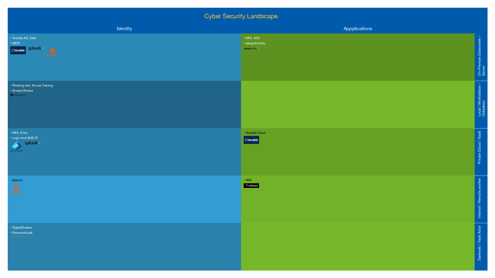

# security-plan-tools-coverage
A tools to illustrate a cyber program in a WYMIWYG way.

Based on YAML description it will generated a rectangular picture (1080p) splitted by domain, scope and color intensity coded based on the coverage of the aera.

- You can use multiple variations of the YAML to illustrate a multi year program.
- You can add domain, column width will adapt
- You can remove/add layer, line height will adapt

 ## To Run

Edit `config/cyber.yaml` based on the provided sample file and run to generate the picture `output.png`.

```
pip intall -r requirements.txt

mv config/cyber.yaml.sample config/cyber.yml
# edit config/cyber.yaml
# add PNG picture to sub directory img/

python generate_landscape.py # output.png is written in root directory
```

## Output Example



## Disclaimer

This project includes logos, icons, or other assets related to cybersecurity tools, organizations, or brands. These assets are used for **educational, non-commercial, or illustrative purposes only**. 

- The logos and trademarks are the property of their respective owners.
- This project does not claim ownership or affiliation with any of the organizations or brands represented by these logos.
- If you are the owner of any logo or asset used in this project and would like it to be removed, please contact me.

Thank you for understanding.